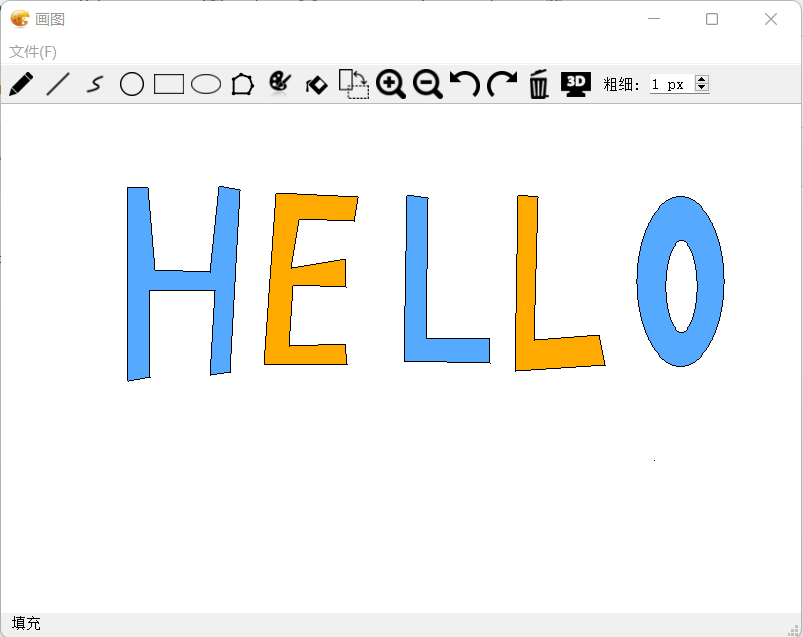

# Graphics Project

This is the course project for *Introduction to Computer Graphics* in NJU. A graphics editor resembling [Microsoft Paint](https://en.wikipedia.org/wiki/Microsoft_Paint) is implemented with `C++` and `Qt`. 

